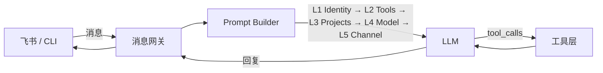
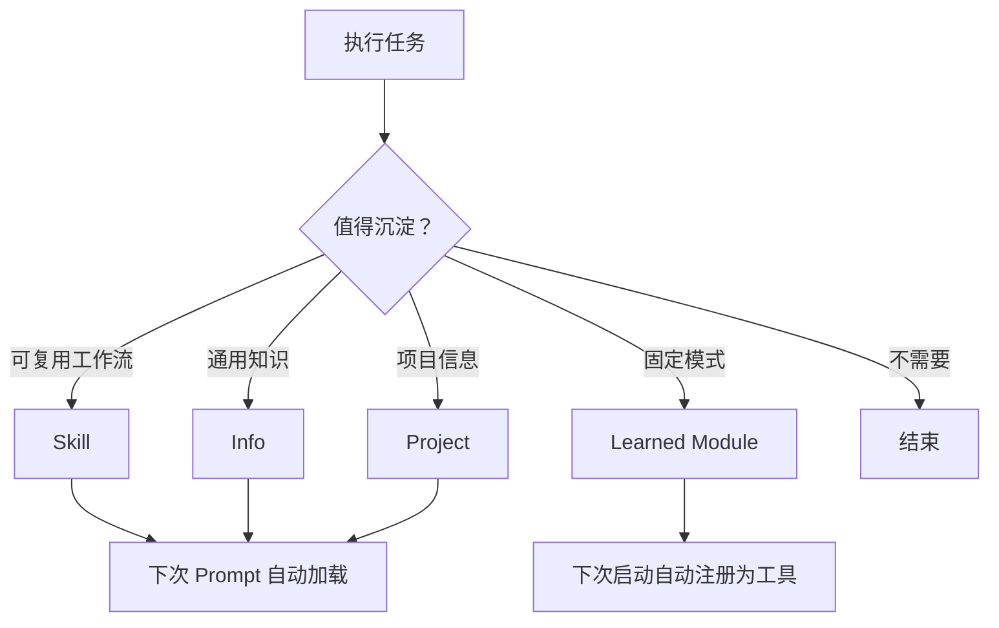

# Lamix

自更新的 AI Agent daemon，和你一起探索这个世界的AI伙计。

## 为什么做 Lamix

LLM 的核心能力是理解语言，但实际把一件事做成，还需要大量 LLM 自身不具备的能力：

- **知识储备**：项目背景、技术栈、历史决策、环境细节
- **工具选择**：同一个问题有多种解法，知道什么时候用哪个工具
- **信息组织**：把散乱的信息结构化，下次遇到类似问题能快速调用

我们认为 AI 就像一个会思考但没记忆、也不会用工具的人——**它天生聪明，知识渊博，但对你的世界一无所知**。决定一个人是否是你的朋友的因素，是你们共同的记忆、经历、行为准则。Lamix 要做的事，就是和你一起帮它积累这些：把做过的事沉淀成技巧（Skills），把学到的知识归档成记忆（Info），把项目的上下文整理成档案（Projects），把合适的工具交到它手里，遇到反复出现的固定任务，还能自己写代码固化成内在能力（Self-learning）。不是你在用一个工具，是你在和一个伙伴一起成长——它学会了做事，你学会了和 AI 协作。

Lamix 把这些能力拆成三层：

| 层 | 说明 | 例子 |
|------|------|------|
| **Skills** | 把反复出现的任务标准化成可复用的工作流，包含决策点的选择依据 | debug 一个复杂 bug 的分步排查流程、用 Claude Code 派发编码任务的规范 |
| **Info** | 通用、零散但长久的知识信息 | 机器 IP 映射、TTS 服务调用方式、环境配置 |
| **Projects** | 专注于某个项目的所有上下文 | 项目路径、技术栈、部署方式、约定规范 |

收到用户请求时，Lamix 的执行循环是：**理解意图 → 组合历史信息（skills + info + projects）→ 选最优解执行 → 反思结果 → 沉淀或更新知识**。

其中反思不只是做对了才沉淀。被用户纠正的错误、过时的方案、不再适用的技能，同样是学习——更新比新增更重要。

它不是一个聊天机器人，是一个会学习的执行者。每次完成任务后自主判断有没有值得记住的东西——新发现的工作流沉淀为 skill，项目相关的信息更新到 project，通用知识归档为 info。过时的知识主动淘汰，不让记忆变成负担。用得越久越懂你。

<details>
<summary><strong>架构</strong></summary>

### 核心流程



### 知识沉淀



| 组件 | 说明 |
|------|------|
| 消息网关 | 飞书 WebSocket + CLI，接收消息、分发回复 |
| Prompt Builder | 5 层分层构建 system prompt |
| Agent 核心 | Tool loop、轮次分段压缩（Compaction V2）、反思沉淀 |
| 知识系统 | Skills + Info + Projects + Learned Modules |
| 进程守护 | Watchdog + Daemon，自动重启 |

</details>

<details>
<summary><strong>功能</strong></summary>

- 多平台消息网关（飞书 WebSocket、CLI）
- 持久记忆与自学习（skills、projects、info）
- 定时任务调度（间隔/cron/一次性延迟）
- Watchdog 进程守护 + 自动重启
- 桌面控制（截图、鼠标键盘、UI 元素查询，需授权）
- 视觉分析（截图 + 视觉模型，需配置模型）
- 自我审计与知识生命周期（自动扫描修复 + 归档未使用知识，可关闭）
- Boot Tasks（重启后自动验证改动）
- Config 热重载（改配置无需重启 daemon）

</details>

<details>
<summary><strong>环境要求</strong></summary>

- Python >= 3.11
- Git
- [ripgrep](https://github.com/BurntSushi/ripgrep)（搜索功能依赖）

</details>

## 安装

<details>
<summary><strong>macOS / Linux</strong></summary>

**1. 安装 ripgrep**

```bash
brew install ripgrep        # macOS
# sudo apt install ripgrep  # Ubuntu/Debian
```

**2. 克隆并安装**

```bash
git clone https://github.com/lampsonSong/lamix.git
cd lamix
pip install -e .
```

**3. 启动**

```bash
# 方式一：交互式 CLI
lamix cli

# 方式二：后台 daemon（飞书消息接收）
lamix gateway
```

</details>

### Windows

<details>
<summary><strong>一键安装（推荐）</strong></summary>

下载源码后，双击 `scripts/install.bat`，自动安装依赖、构建 exe。

产物在 `dist/` 目录：
- **lamix.exe** — 双击启动
- **lamix-uninstall.exe** — 双击卸载

</details>

<details>
<summary>手动安装</summary>

**1. 安装 Python**

1. 访问 https://www.python.org/downloads/ 下载 3.11+
2. 安装时**必须勾选**底部的 `Add python.exe to PATH`

**2. 安装 Git**

1. 访问 https://git-scm.com/download/win 下载安装，默认选项即可
2. 安装时确保勾选 "Add to PATH"（默认已勾选）。装完后打开 CMD 输入 `git --version` 验证

**3. 安装 ripgrep**

1. 从 https://github.com/BurntSushi/ripgrep/releases 下载 `ripgrep-x.x.x-x86_64-pc-windows-msvc.zip`
2. 解压，将 `rg.exe` 放到固定目录（如 `C:\Tools\`）
3. 将该目录加入系统 PATH：此电脑 → 属性 → 高级系统设置 → 环境变量 → 用户变量 `Path` → 新建

**4. 安装 Lamix**

打开 CMD 或 PowerShell：

```cmd
git clone https://github.com/lampsonSong/lamix.git
cd lamix
pip install -e .
```

安装完成后，如果提示 `lamix` 命令未找到，说明 Python 的 Scripts 目录不在 PATH 中。运行以下命令查看路径：

```cmd
python -c "import sysconfig; print(sysconfig.get_path('scripts'))"
```

将输出的路径加入系统 PATH（此电脑 → 属性 → 高级系统设置 → 环境变量 → 用户变量 `Path` → 新建），然后重新打开 CMD 窗口即可。

**5.（可选）注册开机自启**

以管理员身份运行 PowerShell，执行安装脚本：

```powershell
python scripts/install_windows.py
```

</details>

## 使用

### CLI 模式

```bash
# 交互式聊天
lamix cli

# 单条查询
lamix cli "帮我查一下今天天气"
```

首次运行会进入配置向导，引导填写 LLM API Key 和飞书凭证。

### 常用命令

```bash
lamix model           # 重新配置 LLM 模型（供应商/模型/API Key）
lamix update          # 从 GitHub 拉取最新代码并重启 daemon
lamix config          # 查看当前配置
lamix -V              # 查看版本号
```

### Daemon 模式（后台常驻）

> 首次使用请先运行 `lamix cli` 完成初始配置（LLM 供应商、API Key 等），再启动 daemon。

```bash
lamix gateway
```

Daemon 模式启动后通过飞书 WebSocket 接收消息，配合 watchdog 实现进程守护。修改配置后无需重启，daemon 每 30 秒自动热重载。

<details>
<summary><strong>特色功能</strong></summary>

### 定时任务

支持三种触发方式：

| 类型 | 说明 | 示例 |
|------|------|------|
| interval | 固定间隔 | 每 30 分钟检查服务状态 |
| cron | 定时执行 | 每天早 9 点发工作汇总 |
| delayed | 一次性延迟 | 5 分钟后提醒 |

通过飞书或 CLI 对话中直接说"每天早上 9 点提醒我开会"，Lamix 会自动注册任务。

### 自我审计与知识生命周期

每天凌晨 4 点（加空闲触发）自动扫描 skills、projects、info 的健康状态：

- **自动修复**：空目录清理、散落文件合并、缺失信息补全
- **重叠检测**：发现职责重叠的 skills 并建议合并
- **知识归档**：7 天未使用且 0 次调用→归档，30 天未使用→归档。归档不删除，移入 `~/.lamix/archived/`
- 通过飞书发送报告

可在 `~/.lamix/config.yaml` 中设置 `self_audit.enabled: false` 关闭。

### Boot Tasks

改了 daemon 代码需要重启时，先写 boot task 指定重启后的验证步骤。daemon 重启后自动执行验证并汇报结果，不用手动检查。

### 后台任务

Lamix 支持将耗时任务放到后台执行，不阻塞当前对话：

- **独立 Agent**：后台任务创建独立的 Agent 实例，继承发起时的上下文快照（对话历史、项目信息、Skills）
- **结果推送**：任务完成后自动通过原渠道（飞书/CLI）推送结果
- **任务管理**：支持查看运行中的任务、取消任务

典型场景：长时间运行的代码分析、批量文件处理、需要等待的外部命令。对话中直接说把这个任务放到后台即可。

### 桌面控制

Lamix 可以操作鼠标键盘和截屏。需要授权：

- **macOS**：系统设置 → 隐私与安全 → 辅助功能 → 授予终端权限
- **Windows**：以管理员身份运行

### 视觉分析

通过截图 + 视觉模型分析屏幕内容。需要在配置中启用：

```yaml
vision:
  model: "glm-4.6v"
```

未配置时，视觉分析工具会提示用户配置对应模型。

### 开机自启

```bash
# macOS：注册 launchd 服务（watchdog + daemon）
./scripts/install_macos.sh

# Windows：需要管理员权限
python scripts/install_windows.py

# Windows 卸载
python scripts/install_windows.py --uninstall
```

</details>

<details>
<summary><strong>项目结构</strong></summary>

```
lamix/
├── src/
│   ├── cli.py                 # 命令分发器（cli/gateway/model/update/config）
│   ├── daemon.py              # Daemon 主进程
│   ├── watchdog.py            # 进程守护
│   ├── core/
│   │   ├── agent.py           # LLM Agent 核心
│   │   ├── session.py         # 会话管理
│   │   ├── compaction.py      # 上下文压缩（轮次分段 V2）
│   │   ├── prompt_builder.py  # 分层 system prompt 构建
│   │   ├── config.py          # 配置管理
│   │   ├── heartbeat.py       # 心跳机制
│   │   ├── task_scheduler.py  # 定时任务
│   │   └── tools.py           # 工具注册
│   ├── platforms/
│   │   ├── manager.py         # 多平台消息网关
│   │   ├── adapters/
│   │   │   ├── feishu.py      # 飞书 adapter
│   │   │   └── cli.py         # CLI adapter
│   │   ├── process_manager.py          # 进程管理抽象基类
│   │   ├── posix_process_manager.py    # macOS/Linux 实现
│   │   └── windows/
│   │       └── process_manager.py      # Windows 实现
│   ├── tools/
│   │   ├── desktop.py         # 桌面控制
│   │   ├── shell.py           # Shell 命令执行
│   │   └── search.py          # 文件/内容搜索
│   └── feishu/                # 飞书 API 封装
├── scripts/
│   ├── install_windows.py     # Windows 安装脚本
│   └── safe_mode.py           # 安全模式修复
├── docs/
│   └── PROJECT.md             # 项目文档
└── pyproject.toml
```

</details>

<details>
<summary><strong>配置</strong></summary>

配置文件位于 `~/.lamix/config.yaml`，首次运行自动生成。主要配置项：

| 配置项 | 说明 |
|--------|------|
| `llm.api_key` | LLM API Key |
| `llm.model` | 模型名称 |
| `feishu.app_id` | 飞书应用 App ID |
| `feishu.app_secret` | 飞书应用 App Secret |
| `feishu.owner_chat_id` | 飞书 owner 群 ID |

</details>

## 许可证

Private
